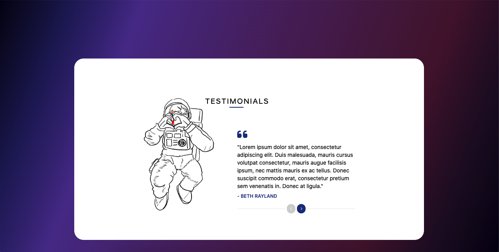

# Desafio Im a developer

Projeto com o desafio da Im a developer

### Tech and patterns used

- React
- Tailwind
- Vite

## Instalação

Baixe o proejto, mude para a sua pasta raiz e instale a dependência com `yarn`

```bash
  cd imadeveloper_challenge
  yarn
  yarn dev
```

## Demo


